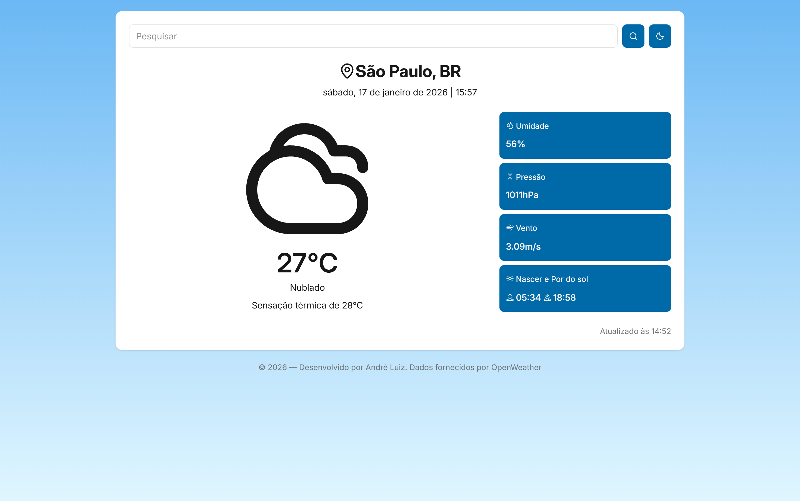
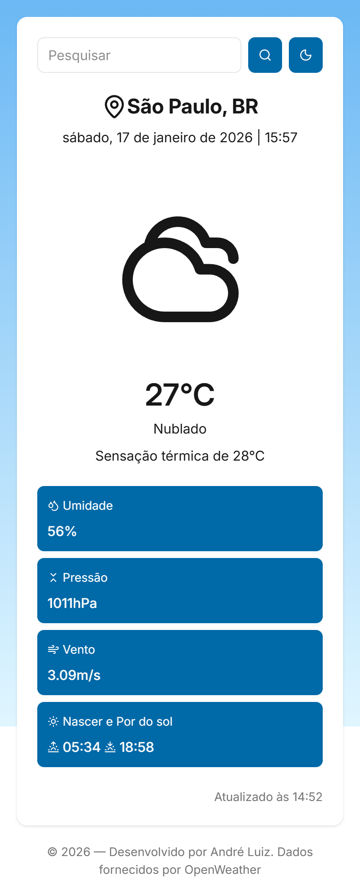

# ☀️ Weather App

Aplicação web que permite consultar informações climáticas em tempo real a partir do nome de uma cidade, exibindo dados como temperatura, sensação térmica, umidade, vento, horário local, nascer e pôr do sol.

O projeto resolve a necessidade de obter dados climáticos de forma simples, clara e organizada, consumindo uma API externa.

Projeto online: https://weather-app-eight-steel-26.vercel.app/

---

## 🖼️ Preview do Projeto



📱 Mobile



---

## 🚀 Funcionalidades

- 🔍 Busca de clima por nome da cidade
- 🌡️ Exibição de temperatura, sensação térmica e umidade
- 💨 Informações de vento (velocidade)
- 🌍 Exibição do país e cidade pesquisados
- 🕒 Cálculo e exibição da data e hora local com base no timezone
- ⏳ Estados de carregamento (loading)
- ⚠️ Tratamento e exibição de erros da API
- 🎨 Mudança dinâmica do fundo com base no horário local

---

## 🧠 O que eu aprendi com esse projeto

Neste projeto, pude aprender e praticar:

- Consumo de APIs REST (OpenWeather API)
- Gerenciamento de estado global com Context API
- Tipagem de dados complexos com TypeScript
- Tratamento de estados assíncronos (loading e error)
- Boas práticas de componentização em React
- Conversão de timestamps e uso de timezone
- Uso de variáveis de ambiente para proteger chaves de API
- Organização de código com hooks e contextos customizados

---

## 🛠️ Tecnologias utilizadas

- React
- TypeScript
- Context API
- OpenWeather API
- Vite
- Tailwind CSS

---

## ▶️ Como rodar o projeto localmente

### Passo a passo

1. Clone o repositório:

```bash
git clone https://github.com/andreluizpo/weather-app.git
```

2. Acesse a pasta do projeto:

```bash
cd weather-app
```

3. Instale as dependências:

```bash
npm install
```

4. Inicie o servidor de desenvolvimento:

```bash
npm run dev
```

4. Acesse no navegador:

```
http://localhost:5173
```

---

## 👨‍💻 Autor

Desenvolvido por André Luiz, com dados fornecidos por [OpenWeather](https://openweathermap.org/).

- LinkedIn - https://www.linkedin.com/in/andreluizpereiradeoliveira
- GitHub - https://github.com/andreluizpo
